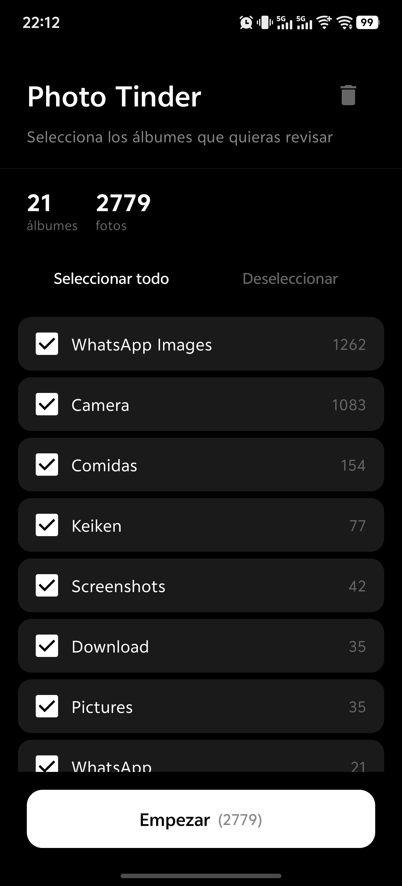
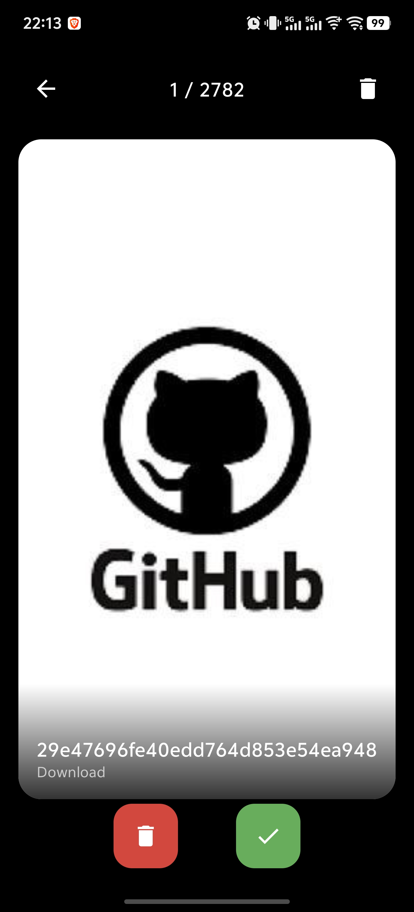

# Photo Tinder

Android app para filtrar y organizar tu galería de fotos con un gesto de swipe, al estilo Tinder.

# PhotoTinder

<p align="center">
  
</p>

<p align="center">
  
</p>

## Características

- **Swipe intuitivo** — Desliza a la derecha para conservar, a la izquierda para descartar
- **Selección por álbumes** — Elige qué álbumes de tu galería quieres revisar
- **Papelera integrada** — Recupera fotos antes de eliminarlas permanentemente
- **Tema OLED** — Interfaz minimalista en negro puro, optimizada para pantallas AMOLED
- **Ligera** — Sin dependencias externas innecesarias, construida con Jetpack Compose

## Capturas

| Menú principal | Swipe | Papelera |
|---|---|---|
| Selección de álbumes con diseño minimalista | Desliza para conservar o descartar | Recupera o elimina permanentemente |

## Requisitos

- Android 8.0 (API 26) o superior
- Permiso de acceso a almacenamiento

## Instalación

Descarga el APK desde la [sección de releases](https://github.com/ephemere24/PhotoTinder/releases) e instálalo manualmente.

## Desarrollo

### Estructura

```
app/
├── src/main/
│   ├── java/com/phototinder/
│   │   ├── MainActivity.kt          # Entry point
│   │   ├── ui/
│   │   │   ├── PhotoTinderApp.kt    # UI principal (Setup, Swipe, Trash)
│   │   │   └── theme/Theme.kt       # Tema OLED
│   └── res/
│       ├── mipmap-*/                # Iconos del launcher
│       └── values/strings.xml
```

### Build

```bash
./gradlew assembleDebug
```

## Tecnologías

- **Kotlin** + **Jetpack Compose** — UI declarativa
- **Material 3** — Componentes de diseño
- **MediaStore API** — Acceso a la galería del dispositivo

## Licencia

MIT License. Ver [LICENSE](LICENSE) para más detalles.
